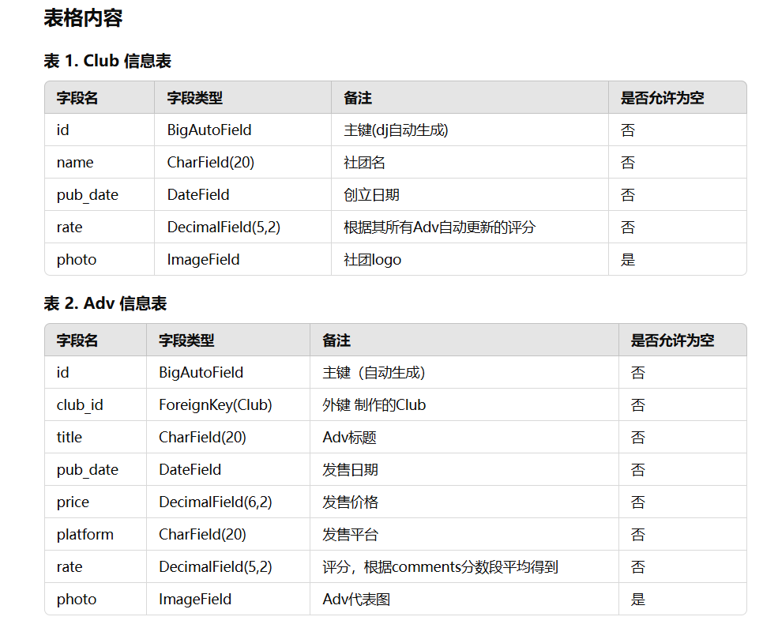

# 视觉小说评价系统
## 一.目的和背景
    视觉小说(ADV)是结合了视觉与听觉的第九艺术，在过去数十年内已造就无数经典。
    目前日本有Adv评价网站 批评空间(https://erogamescape.org/~ap2/ero/toukei_kaiseki/)，西方有VNDB(https://vndb.org/).
    而国内由于种种原因始终没有类似的网站，我决定不畏困难踏出一步，制作该平台让更多人了解到优秀的Adv作品。
    据调查发现，这不仅是复旦有史以来第一个开创性的Adv平台项目，更是目前中国首创的Adv评价平台，具有极强的创新性。

    在该平台的基础层面，我已经实现了极其自由的查看各种信息，功能。并且为平台打造了极为美观的UI设计。
## 二.数据库设计:
### 1.表结构设计
    ADV信息表：包含ADV的书名、外键制作社团、发行日期、发售平台、价格、评价(分数+评论)、分数。
    评论信息表：包含外键用户评价(分数+评论)、外键ADV。
    用户信息表：包含用户名、密码、性别、职业、头像。
    社团信息表：包含名字、制作的adv、创立时间、评分(根据作品加权评分)、logo相片

逻辑结构表格如下：


### 2.概念结构设计
E-R图如下：
使用django-extension根据项目生成，右侧部分为主要models的设计。


### 3.物理结构设计
在本项目中，我们选择使用关系型数据库管理系统(RDBMS)来存储和管理数据。根据每个表的主键和外键设计了相应的索引，以确保数据检索的效率和完整性。

## 三. 系统设计与实现
### 1.功能要求
#### 基本功能要求:
    1.用户注册和登录
    2.用户添加Adv信息，Club信息。
    3.用户评价ADV。
    4.查看ADV信息。
    5.查询社团信息
#### 进阶功能：
    1.自由地通过链接查看Adv的Club，Club的Adv，在Adv详情页转向评论等。
    2.前端:
        2.1看板娘
        2.2为每个页面添加了独特的bgm.其中每个社团的bgm都是该社灵魂bgm，每个Adv同理。

### 2.项目网页：
主页如图，详细请点开网页，可以ip直连访问。

http://49.235.184.91/index/

http://www.adv.xn--6qq986b3xl/index/
(域名报备没过....)

项目github:
https://github.com/eeeshushusang/-PJ_ADV-

### 3.后端：(工作量30%)
galgame信息：
wiki; CNGAL; DLsite; Steam;

#### 亮点逻辑：
##### Ⅰ.用户评论后，自动层层更新相关分数。
```python
# 在保存评论时，自动调用相关Adv的保存函数，更新Adv的评分。
# comments的save函数
def save(self, *args, **kwargs):
        super().save(*args, **kwargs)
        self.adv.update_average_rate()
# Adv在保存时自动调用函数更新平均分。
# Adv的更新和save函数
def update_average_rate(self):
        # 从 CompositeField 中提取 decimal_part 并计算平均值
        comments = self.Comments_set.all()
        total_score = sum([comment.comments.decimal_part for comment in comments])
        count = comments.count()
        self.rate = total_score / count if count > 0 else 0
        self.save()
        self.club.update_average_rate()  # 更新相关 Club 的评分
# 继而，相关Club也会自动调用保存函数更新Adv平均分。
# Club的save和更新函数
def update_average_rate(self):
        advs = self.adv_set.all()
        total_score = sum([adv.rate for adv in advs])
        count = advs.count()
        self.rate = total_score / count if count > 0 else 0
        self.save()
```


#####  Ⅱ.评论时，默认将使用的用户作为评论者
```python
# 相关代码：
if comments_form.is_valid():
            comment = comments_form.save(commit=False)
            user_name = request.session.get("user_name")
            if not user_name:
                message = "用户未登录或未找到"
                return render(
                    request,
                    "comments.html",
                    {"comments_form": comments_form, "message": message},
                )
            user = get_object_or_404(User, name=user_name)
            comment.user = user
```

注意，此处我们避免了使用我们定义的User来替代Django默认Usser的做法，那样会过于复杂。

### 4.前端：(工作量50%)
- live2d最简单的抄法：
https://github.com/stevenjoezhang/live2d-widget
- 登陆,注册，上传信息等页面样式参考：
https://www.bilibili.com/video/BV1X3411y7of/?spm_id_from=333.880.my_history.page.click&vd_source=efbe71818b8135cefb115ae13d27eec1
- 山羊鼠标样式：
https://www.bilibili.com/video/BV1wb4y1a7uQ/?spm_id_from=333.880.my_history.page.click

#### 4.1图片：
-    全局背景：Anmi https://www.pixiv.net/users/212801
-    部分网页框内背景：Weri https://www.pixiv.net/users/20728711

#### 4.2音乐：
-    首页，上传信息页： MANYO,三輪学 - 黑猫さんの背伸び
-    橘子班/高考恋爱100天：Days - Nuit Silencieuse    
-    AliceSoft：アリスソフト - かわいいのでてきた
       兰斯10：アリスソフト - the end
       兰斯7 战国兰斯：アリスソフト - My Glorious Days
-    Leaf:上原れな - 届かない恋 (Instrumental)
        白色相簿1：石川真也 - FILL YOU
        白色相簿2：石川真也 - あの頃のように
-    枕社：松本文紀 - 夜の向日葵
        樱之诗：松本文紀 - 夢の歩みを見上げて
        樱之刻：松本文紀 - 櫻ノ詩 -2023Mix inst ver-
-    Key社：麻枝准,Key Sounds Label - 渚
        Summer Pockets:麻枝准 - Sea, You & Me
        Clannad:麻枝准 - 同じ高みへ

### 5.部署上线：(工作量20%)   
腾讯云：服务器(学生折扣)10r/月;

域名：首年10元(便宜的中文域名)

使用nginx绕过域名报备进行上线，非常麻烦，实现了可IP直连访问。

遗憾的是，域名审批终究没有通过，原因是使用中文域名，无法添加CNAME解析，SSL审核未通过。

这也告诉我们，做个人网页还是选择海外服务器比较好，可以免去报备域名的工作。

### 四.后续跟进计划：
- live2d：本打算从BA中扣一个乐队爱丽的小人模型下来，结果发现不会用相关软件，不了了之。
- 音乐：实现同一曲目在不同网页播放时，继承上个网页的播放进度
- 鼠标特效可以做的更好看点
- 修改bgm的model逻辑，将bgm作为Adv的属性添加，从而可以更自然地进行处理。
