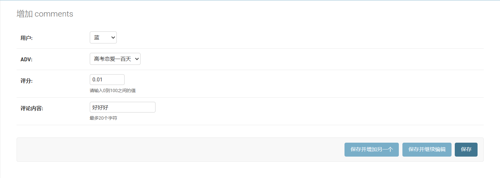
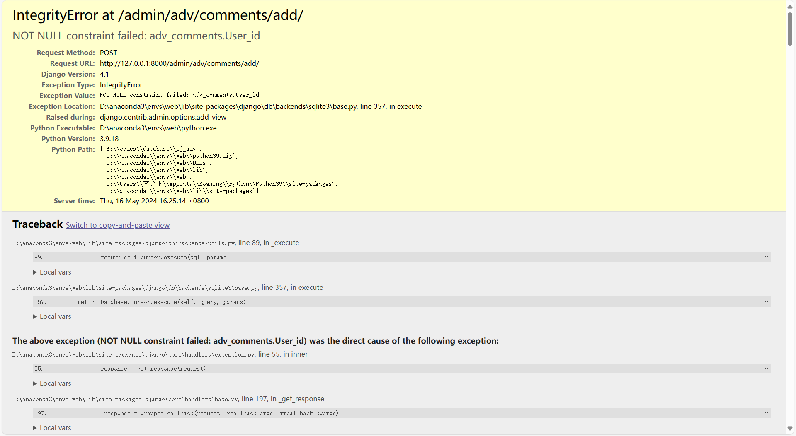

我的bug是

报错

我在Comments中使用了外键User，没有主动指定主键，而是约定了User.name不会相同，以此区分。
已知，我同样在Adv中使用了外键Club，同样没有指定主键,以Club.name为区分。没有问题。我不知道这是出什么问题了。。

以下是我的models中的定义：
class Club(models.Model):
    name = models.CharField(max_length=20)
    pub_date = models.DateField('date published')
    rate = models.DecimalField(max_digits=5, decimal_places=2, default=0)  # Store the average rate
    photo = models.ImageField(upload_to="Club_images", blank=True)

    def update_average_rate(self):
        self.rate = self.adv_set.aggregate(Avg('rate'))['rate__avg'] or 0
        self.save()

    def __str__(self):
        return self.name  # 添加此方法以显示友好的名称

class Adv(models.Model):
    club = models.ForeignKey(Club, on_delete=models.CASCADE)
    title = models.CharField(max_length=20)
    pub_date = models.DateField('date published')
    price = models.DecimalField(max_digits=6, decimal_places=2)
    platform = models.CharField(max_length=20)
    rate = models.DecimalField(max_digits=5, decimal_places=2, default=0)  # Store the average rate
    photo = models.ImageField(upload_to="adv_images", blank=True)

    def update_average_rate(self):
        self.rate = self.Comments_set.aggregate(Avg('comments__decimal_part'))['comments__decimal_part__avg'] or 0
        self.save()

    def __str__(self):
        return self.title  # 添加此方法以显示友好的名称

class User(models.Model):
    name = models.CharField(max_length=20)  # 注册用户名
    password = models.CharField(max_length=20)
    job = models.CharField(max_length=20)
    sex = models.CharField(max_length=1, choices=[('M', '男'),  ('F', '女')], default='M', blank=True)
    photo = models.ImageField(upload_to="User_images", blank=True)

    def __str__(self):
        return self.name

    class Meta:
        ordering = ["name"]
        verbose_name = "用户"
        verbose_name_plural = "用户"

class Comments(models.Model):
    User = models.ForeignKey(User, on_delete=models.CASCADE, related_name='Comments')
    comments = CompositeField()  # CompositeField to include rating and text comment
    adv = models.ForeignKey(Adv, on_delete=models.CASCADE, related_name='Comments_set')  # ForeignKey to relate to Adv

    # 商品评价，包含打分和字符串评价
    # DecimalField(max_digits=5, decimal_places=2)和CharField(max_length=20)

以下为forms中相关：
class CommentsForm(forms.ModelForm):
    decimal_part = forms.DecimalField(
        label="评分",
        max_digits=5,
        decimal_places=2,
        min_value=0,
        max_value=100,
        widget=forms.NumberInput(attrs={'class': 'form-control'}),
        help_text="请输入0到100之间的值"
    )
    char_part = forms.CharField(
        label="评论内容",
        max_length=20,
        widget=forms.TextInput(attrs={'class': 'form-control'}),
        help_text="最多20个字符"
    )
    user = forms.ModelChoiceField(
        queryset=User.objects.all(),
        label="用户",
        widget=forms.Select(attrs={'class': 'form-control'})
    )
    adv = forms.ModelChoiceField(
        queryset=Adv.objects.all(),
        label="ADV",
        widget=forms.Select(attrs={'class': 'form-control'})
    )

    class Meta:
        model = Comments
        fields = ['user', 'adv', 'decimal_part', 'char_part']

    def __init__(self, *args, **kwargs):
        super().__init__(*args, **kwargs)
        if self.instance and self.instance.comments:
            self.fields['decimal_part'].initial = self.instance.comments.decimal_part
            self.fields['char_part'].initial = self.instance.comments.char_part

    def save(self, commit=True):
        instance = super(CommentsForm, self).save(commit=False)
        composite_value = CompositeValue(
            decimal_part=self.cleaned_data['decimal_part'],
            char_part=self.cleaned_data['char_part']
        )
        instance.comments = composite_value
        if commit:
            instance.save()
        return instance

以下为views中相关函数：
def comments(request):  # 对某adv评论
    if request.method == 'POST':
        comments_form = CommentsForm(request.POST, request.FILES)
        if comments_form.is_valid():
            comment = comments_form.save(commit=False)
            comment.user = comments_form.cleaned_data.get('user')
            comment.save()
            return redirect('/index/')  # 假设有一个成功页面或其他逻辑来处理更新后的操作
        else:
            message = "表单验证失败，请检查填写内容。"
            return render(request, 'adv/comments.html', {'comments_form': comments_form, 'message': message})
    else:
        comments_form = CommentsForm()
        return render(request, 'adv/comments.html', {'comments_form': comments_form})

以下为html:

<!doctype html>
<html lang="en">
<head>
  <!-- Required meta tags -->
  <meta charset="utf-8">
  <meta name="viewport" content="width=device-width, initial-scale=1, shrink-to-fit=no">

  <!-- Bootstrap CSS -->
  <link href="https://stackpath.bootstrapcdn.com/bootstrap/4.3.1/css/bootstrap.min.css" rel="stylesheet">
  <link href="" rel="stylesheet" />

  <title>评价ADV</title>
</head>
<body>
  

    

      <form class="form-register" action="/comments/" method="post" enctype="multipart/form-data">
        
        <h3 class="text-center">评价ADV</h3>

        
          
{{ message }}

        

        

          {{ comments_form.user.label_tag }}
          {{ comments_form.user }}
        

        

          {{ comments_form.adv.label_tag }}
          {{ comments_form.adv }}
        

        

          {{ comments_form.decimal_part.label_tag }}
          {{ comments_form.decimal_part }}
        

        

          {{ comments_form.char_part.label_tag }}
          {{ comments_form.char_part }}
        

        <button type="submit" class="btn btn-primary float-right">上传</button>
      </form>
    

  <a href="/index/" class="btn btn-primary">返回首页</a>
  
 <!-- /container -->

  <!-- Optional JavaScript -->
  
  
  
</body>
</html>
